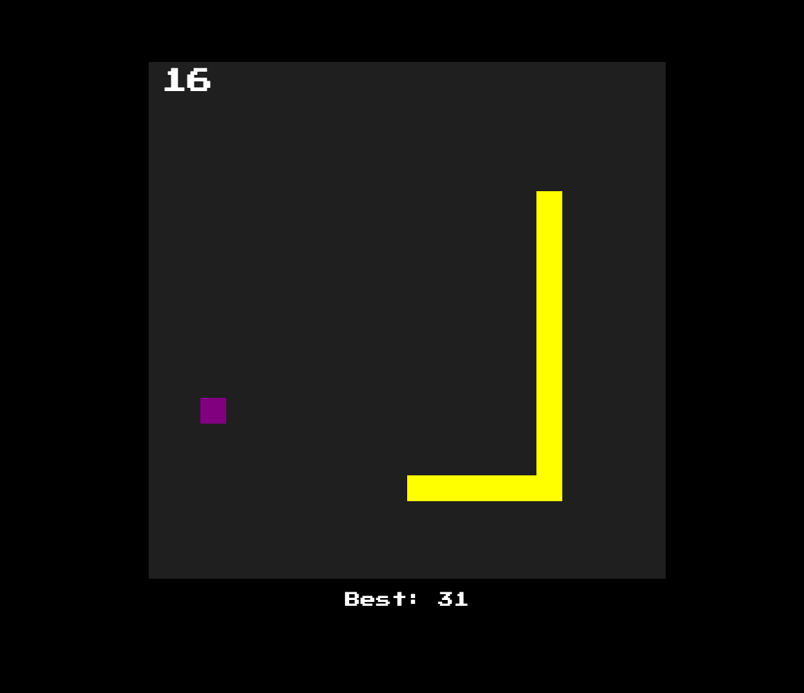
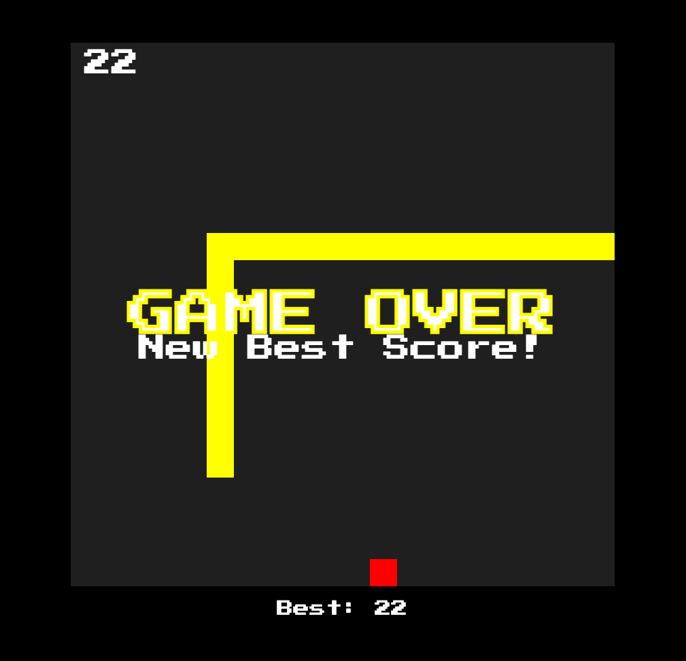
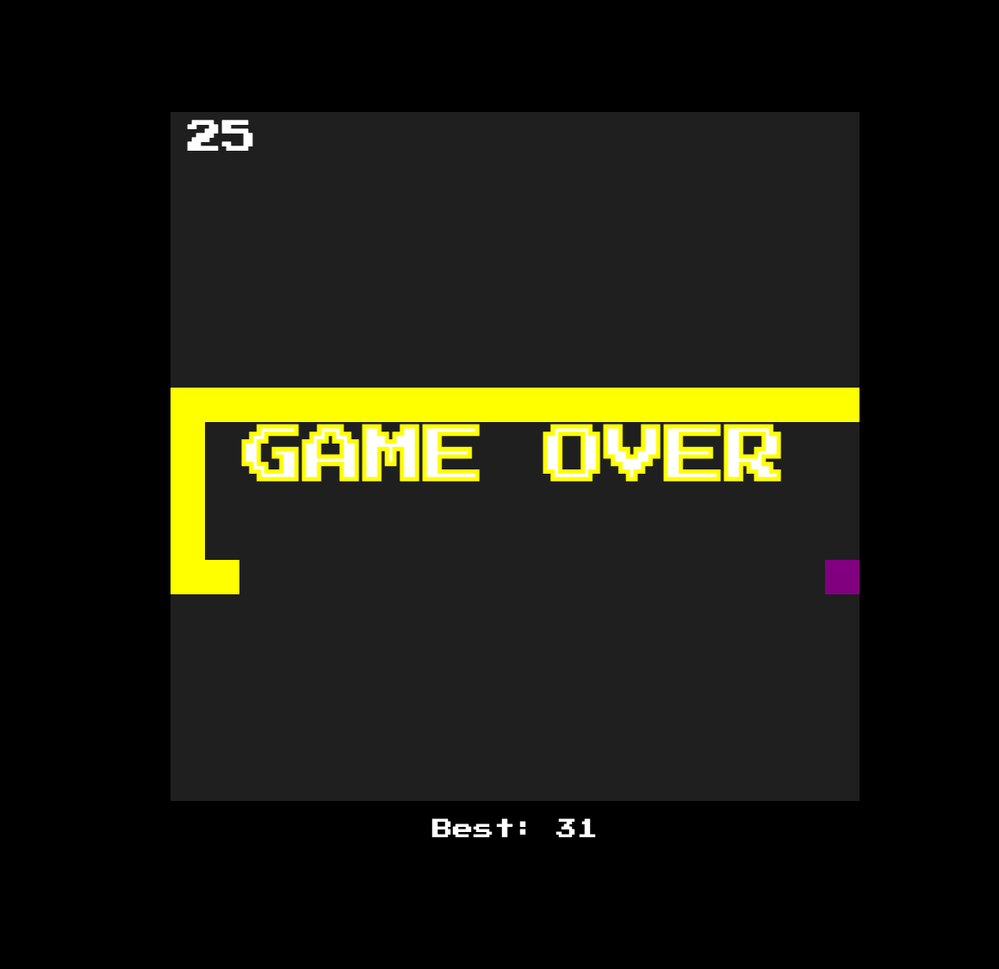

# JS Snake

This is a simple old-school snake game written in vanilla JavaScript. The game includes point tracking, high score (stored to local browser storage), and sound effects when the snake eats an apple, sets a new high score, or the game ends! 🍎🐍

## Game Play

## New Best Score

## Game Over

